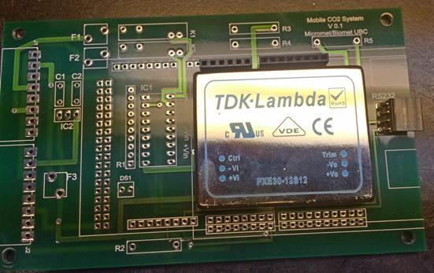
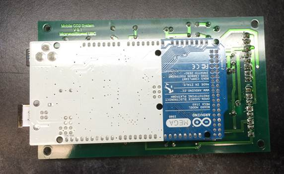
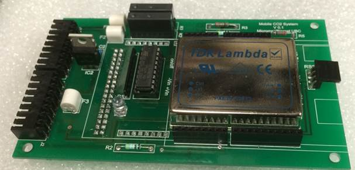

# Custom Hardware Board Assembly

1. Mount DC/DC power supply (PXE30-12S12)
2. Once soldered on the board, cut its pins (otherwise they'll touch Mega's ICSP header).
3. Install 4-pin RS232 connector (header)
4. Install top two Sockets for GPS Shield:

	

5. Install the top 3 8-pin headers for Arduino Mega (all headers are bottom facing!!)

	

	

6. Install Relay driver socket and the resistor network (otherwise with all sockets and headers installed there will be no access for the soldering iron)

	

7. Install the diode (DS1).  Flat part goes towards the DC/DC power supply (TDK-Lamda)
8. Cut the diode pins
9.  Install all ONE-ROW headers into the Arduino Mega (just push the pins into the Mega's sockets).
10.  Install the Mega into the shield and solder the pins

	

	

11.  Put the sockets into the GPS board (just push them in onto the headers).
12.  Mount the GPS board over the DC/DC power supply.  In the pictures below, the GPS unit has 2 upward facing headers on the bottom of the board.  Those are not needed for the system operation (they were left over from a previous prototype.)
13.  Solder the bottom set of pins (the newly installed sockets)

	

14. At this stage the GPS board is fully mounted.  Remove it.
15. This is what how the board looks so far:

	

	

16. Bend 4 resistors (2 x 10k, 2 x 5k) at 0.5" mark and solder them on the board:

	

	

17. Cut resistor pins.
18. Install and solder two top fuses with their openings (holes) facing to the left.

	

19. Install the two relays.

	

20. Insert 2-row header into the Mega and put the Mega onto the board.
21. Solder 2-row header

	

22. Solder two capacitors.
23. Cut the pins

	

24. Solder 7805
25. Cut the pins
26. Solder the last fuse holder (holes facing "down")

	

27. Solder the two 8-position black connectors

	

28. Inspect
29. Mount UNL2803A

	

	

	

33. Mount GPS

	

34. Populate Fuses

	

35. Finally look at the board without Arduino Mega and GPS

	

	
